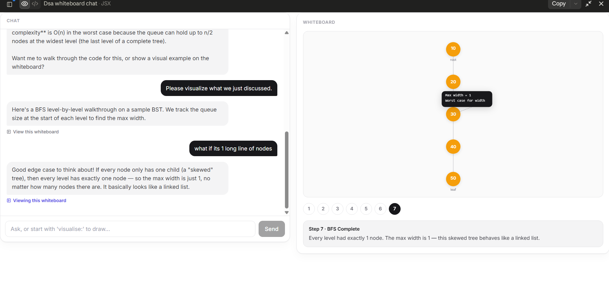

# DSA Whiteboard — backend proxy



## Setup

1. `cd server && npm install`
2. Copy `.env.example` to `.env` and paste in your real Anthropic API key.
3. `npm start` — runs on `http://localhost:3001`

## Frontend change needed

In the React component, change the fetch call from:

```js
fetch("https://api.anthropic.com/v1/messages", ...)
```

to:

```js
fetch("http://localhost:3001/api/chat", ...)
```

(or your deployed backend's URL, once hosted). Everything else — the request
body shape, the system prompt, the marker parsing — stays exactly the same.
This server is a pass-through; it doesn't know anything about whiteboards.

## Deploying

Any Node host works — Render, Railway, Fly.io, or a Vercel serverless
function. Set the `ANTHROPIC_API_KEY` environment variable on whichever
platform you pick, then update the frontend's fetch URL to the deployed
address.
